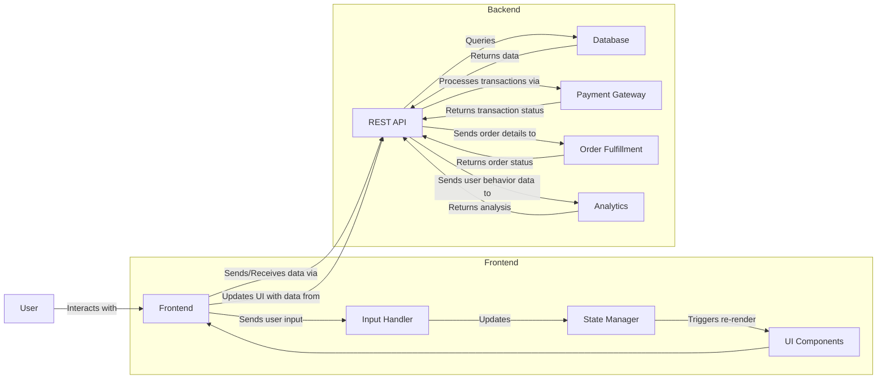

# notes

```mermaid
graph LR
  A[User] -->|Interacts with| B[Frontend]
  subgraph Frontend
    B -->|Sends user input| BA[Input Handler]
    BA -->|Updates| BB[State Manager]
    BB -->|Triggers re-render| BC[UI Components]
    BC --> B
  end
  B -->|Sends/Receives data via| C[REST API]
  subgraph Backend
    C -->|Queries| D[Database]
    D -->|Returns data| C
    C -->|Processes transactions via| E[Payment Gateway]
    E -->|Returns transaction status| C
    C -->|Sends order details to| F[Order Fulfillment]
    F -->|Returns order status| C
    C -->|Sends user behavior data to| G[Analytics]
    G -->|Returns analysis| C
  end
  B -->|Updates UI with data from| C
```
